Lakmal Pinnaduwage

**Activity 1**

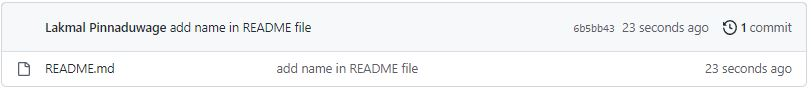

**Activity 2**

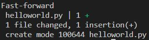

**Activity 3**

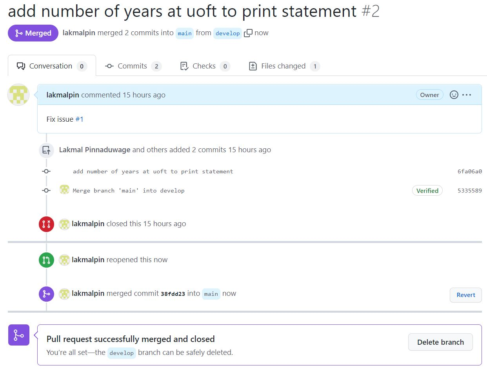

**Activity 4**

https://github.com/Edwinz28/ECE444-F2022-Lab1

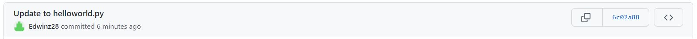

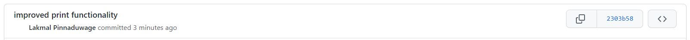

**Activity 5**

Rebase command:

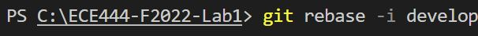

Rebase successful:
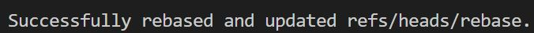

Merge rebase branch to develop:
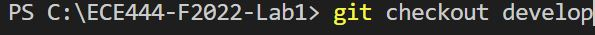

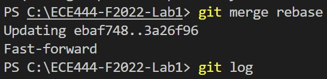

Git log of develop:
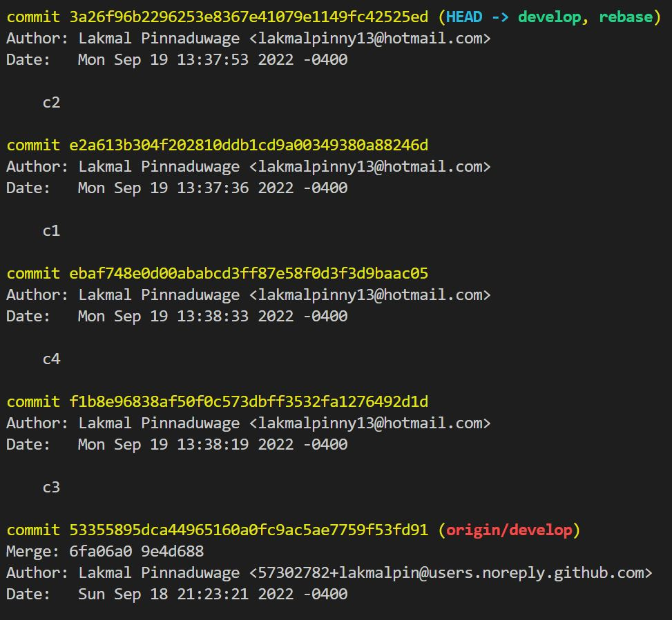

**Activity 6**
https://github.com/lakmalpin/ECE444-F2022-EP

**Activity 7**
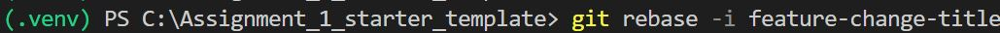

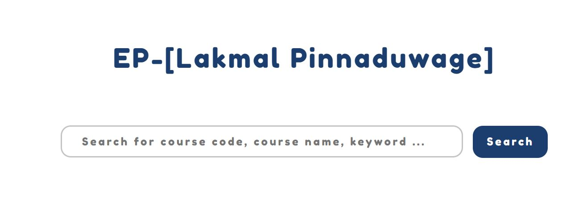

**Activity 8**
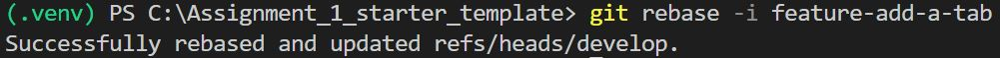

